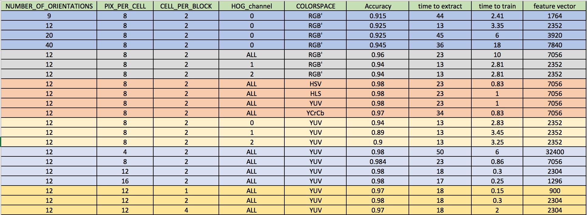
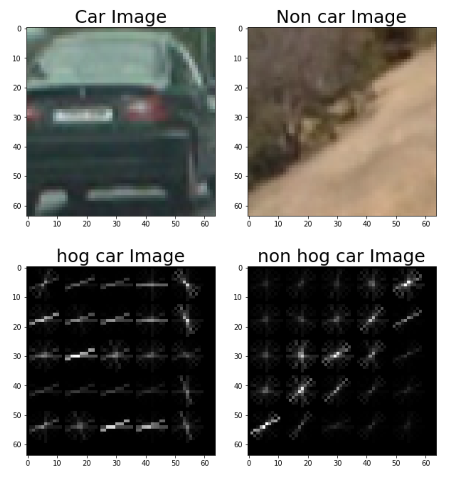
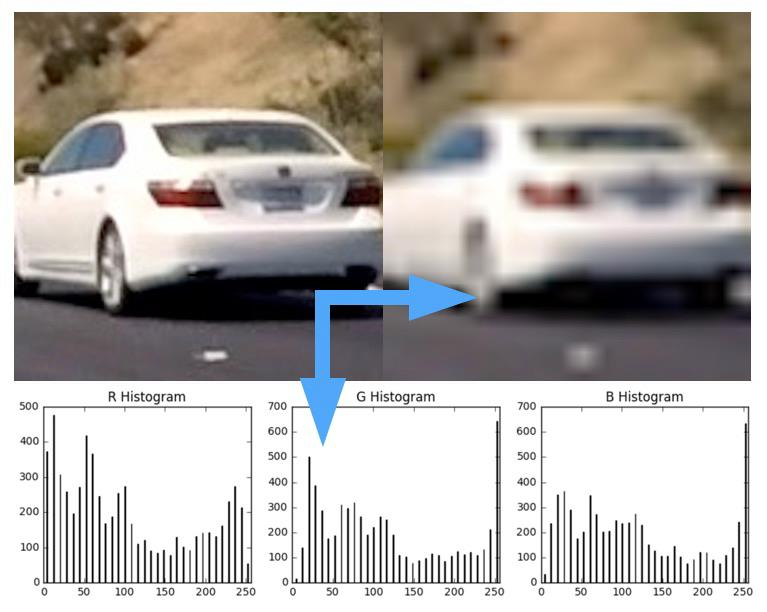
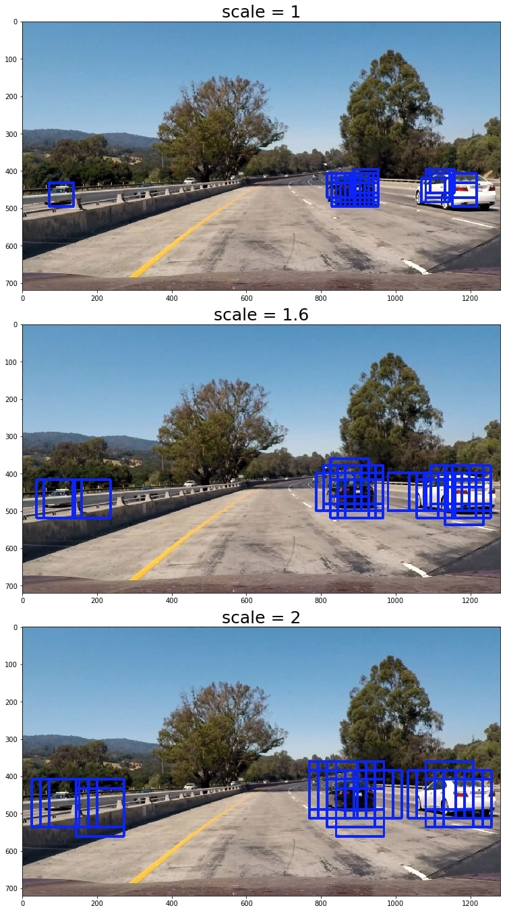
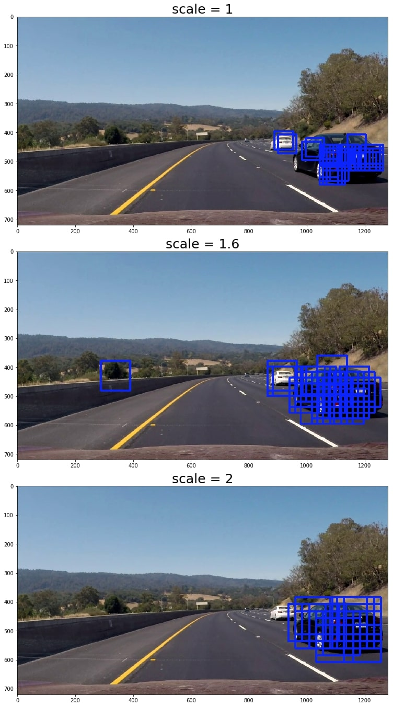
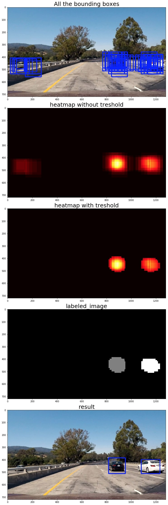

Omar Benzakour
---

# Self-Driving Car Engineer Nanodegree

## Project: **Vehicle detection** 

The goals / steps of this project are the following:

* Perform a benchmarking of the Histogram of Oriented Gradients (HOG) feature extraction on a labeled training set of images and train a classifier Linear SVM classifier
* To these features we will a append binned color features, as well as histograms of color.
* We will then implement a sliding-window technique and use your trained classifier to search for vehicles in images.
* We will also create a heat map to reject outliers and estimate a bounding box for vehicles detected.
* Finally we will run our pipeline on a video stream to track passing cars

## Dataset exploration

Let us load our dataset and start with some remarks regarding it:

1. The car images are 64x64 png colored images
2. Contrary to the traffic signs panels dataset the images of the cars are clear. Indeed, a human being
can clearly identify that the images are representing cars. While this dataset does not contain unclear images, it contains an awful lot of duplicates (same car with a slight different lightining/angle) because the dataset have been generated from a time serie data. If we just take the dataset as is and just split it randomly into a training/cross-validation and test set, we will have a lot of images that will be shared between the datasets. The result will be a model that will overfit the data with a good accuracy regarding all the different datasets. In order to avoir this we will manually create our training/validation and test datasets. Since the images are numbered and since the images that represent the same car are following one another we will try to put the same images in the same dataset. Therefore we will partition the data following this rule :

> * 0 <= image_number % 250 < 184 => training set
> * 194 <= image_number % 250 < 240 => test set

Once we have split the data, we will shuffle it to avoid having an order in our datasets. Morevover, we don;t need to bother working with generators because our the size of our dataset is small ( 300 mb )

## Histogram of Oriented Gradients (HOG)

In this section we will take the images of our dataset as an input and apply to them the hog transform. The output of the HOG transform will then be fed to our machine learning pipeline as features to train our classifier. In order to apply the HOG transform to an image, several parameters should be set (color space, orientations, pixelspercell, cellsperblock). In order to know which parameters work best we will test them and pick the configuration which has a nice tradeoff between the extraction time, the number of features and the training time. We have summarized below the results of our tests.

### Benchmarking remarks and conclusion

1. **effect of the number of orientation** : Increasing the number of orientations considerably increases the learning time and increases the number of features and the extraction time. if we compare extreme values 12 with 40 orientations and keep the other parameters the same. We have an accuracy gain of 0,2 but we multiplied by 6 the training time and by 4 the extraction time. we also multiplied by 3 the number of features. This accuracy gain is not worth it because changing other parameter is more benefic as we will see. We will therefore take 12 orientations
2. **effect of the color space **: When working with the HOG, RGB is no good. Indeed the learning time using the RGB color space is 10 times slower than the learning with the other channels. Moreover the extraction time is 2 times slower than the other channel. (The LUV color space throws an exception, so we will not work with it). HLS, HSC and YUV are approximatevely the same. We will slect the YUV channel because the learning time is lower than the others
3. **effect of the channels **: taking all the channels brings 3 times more features than one, but considerably increases the accuracy. We will therefore pick the features from all the 3 channels. This statements holds for the RGB color space as for the YUV colorspace
4. **effect of the pixels per cell **: increasing the number of pixels per cell considerably decreases the extraction time, the number of features and the training time. This increase also brings a really small decrease in accuracy. 8 px per cell has the best accuracy but bings more features thus slows the training time. We will therefore pick 12 or 16 pixel per cell because they decreasing the learning and extraction time without impacting the accuracy that much
5. **effect of the cell per block** : increasing the number of cells per bloc increases the number of features. keeps the the extraction time the same and increases the precision up to a certain point and then decreases the accuracy. **The best value is 2 **in our case ]

**Conclusion :**

> * COLORSPACE = 'YUV' 
> * NUMBEROFORIENTATIONS = 12 
> * PIXPERCELL = 12 
> * CELLPERBLOCK = 2 
> * HOG_CHANEL = "ALL"> 

Let us see now an example of the hog transform we get using our parameters:

### Extracting color and spatial features

To the hog features we will add the following features: 1. Color channel histograms : We represent in the form of histograms the number of pixels in function of their intensity in the R, G, B color space. The goal of these features will be to detect if an image holds the colors of the cars. These features only rely on the color of the image. 2. raw pixels values : the features consist of the raw pixels of the car after processing the image with a spatial binning. We do that to reduce the noise and because the full resolution does not provide more information to classify an image into a car or non car. When ploting the distribution of the color pixels in the HSV referential we can better clusterize the pixels that belong to the car than in the RGB color space. Therefore we will use the HSV color base for these features.
We can at the right of the original image after a spatial binning and below the car the histogram in the R,G,B channels

### Training pipeline

We extract three different types of features, each feature takes its value from a a different range of values.
Because these range of values do not have the same order of magnitude we will use a per column scaler to avoid having a feature that is ridiculously small in front of another. For this project we will use and SVM classifier with linear kernels. We achieve a 98% accuracy on the test dataset

### Sliding window search

We have a model that classifies a 64x64 image into a car or a non car, we need to apply this model to an image captured by the camera located in the middle of the car. In order to do that we will use sliding windows. We will compute the hog transform of the bottom half of the image, then will slide a bounding box and see if the image inside the bounding box is a car or not. To improve our result of the search we have 2 parameters to adjust:

1. The size of the bounding box
2. The step at which we move the bounding box (in term of hog cells)\

Depending of their position from the camera, the cars will not have the same size. The closer to the camera they are, the bigger they will appear. To capture that we will take use the sliding window search with 3 different size (64x64, 102x102 and 128x128). We will use opencv to fit these bounding boxes to 64x64 bounding boxes.

The window step is also an important factor, indeed if we use a small step we will detect more cars and unfortunately more false positives. I have found that using a small step works better because it is easy to filter false positives. We will therefore take a step of one block and build a component in our pipeline that will filter the false positives.

The following pictures present the resulting bounding boxes for differents scales of the window. One pictures contain 2 small cars, the other contain one small car and a bigger one. We can see that in both cases we achieve good results. Let us now build the rest of the pipeline

Let us use an image where one car is bigger than the other to see if we detect it well

### Filtering false positives and extracting one bounding box per car

From the bounding boxes that were classified as cars, let us build a heatmap (every bouding box will add 1 to the pixels it contains). We will then apply a treshold on the heatmap to filter false positives. Finally we will use the label function to frame one car by one bounding box

Let us see the complete pipeline:

## Conclusion and discussion

In this project we have built a pipeline to detect vehicles. We have trained an SVM classifier that relies on color, shape and spatial features. We managed to train this classifier and get 98% accuracy on the test set. There are several ways we could have improved this pipeline:

1. This pipeline is optimized for cars, we don't know how it will behave with other vehicles (buses, motocycles, byciles, ...)
2. The extraction of the hog features is sooooo slow. It is definitely not possible to use this solution in real time. It takes more than one hour to extract the video
3. The variation and the jittering of the bounding box is annoying, I should have implemented a filter to smooth it (working on it)
4. This pipeline will definitely not work at night because it was only trained with pictures of cars taken during the day
5. The spatial and color features are not thaaat usefull. I have managed to have a similar result using only the hog features. The time for processing the video was divided by 3